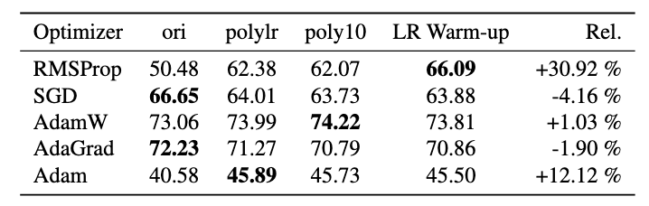
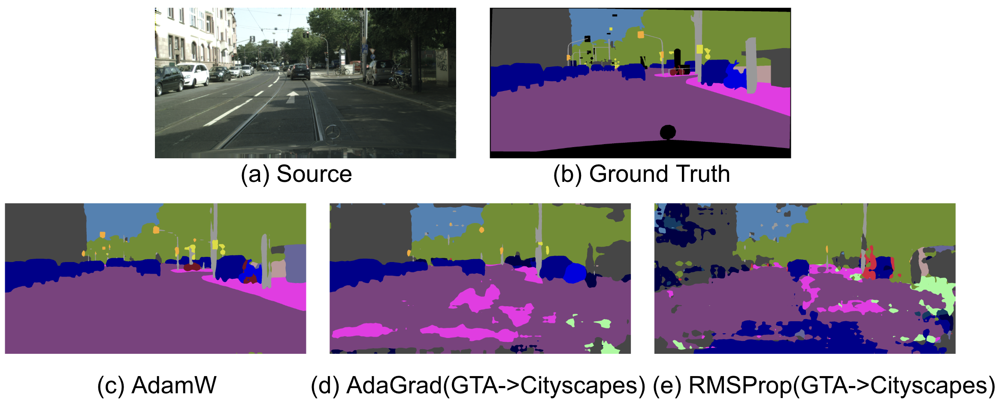
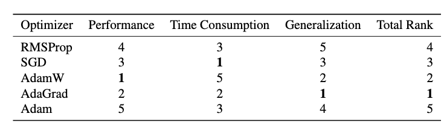

# optimizer_evaluation

Optimization algorithms are a cornerstone of machine learning, dictating how effectively models converge to solutions. Despite the success of many optimization algotihms, these algorithms face significant limitations, such as sensitivity to hyperparameters, inefficiency on non-convex landscapes, and lack of adaptability across tasks. In this work, we focused on evaluating and experimenting with existing optimization algorithms across diverse tasks in various domains. The goal is to understand the conditions under which specific algorithms perform optimally and to explore enhancements such as learning rate scheduling and warm-up strategies. By systematically applying and analyzing these algorithms, we aim to provide insights into how to effectively adapt optimization techniques to improve model performance across different scenarios. We evaluated 5 optimizers which are Adam, AdamW, AdaGrad, SGD, and RMSProp on semantic segmentation, image classification, language modeling, and text classification tasks. 

For semantic segmentation task, our baseline code is from DAFormer paper code. So, you can check detailed information on their github.

# Semantic Segmentation Experiments
``` cmd
1. Evaluate the performance of each optimizer.
2. Evaluate the performance of each optimizer with the Poly10 scheduler.
3. Evaluate the performance of each optimizer with the PolyLR scheduler.
4. Evaluate the performance of each optimizer with a warmup strategy.
5. Evaluate the performance in cross-domain adaptation (GTA5 → Cityscapes) to check generalization performance.
```

# Results


ori represents the original version without any schedulers or warm-up applied. polylr refers to the Polynomial Decay Schedule with a power of 0.9, while poly10 uses a power of 1.0. Rel indicates the relative improvement between the ori and warm-up results, expressed as a percentage.





(c) illustrates the results of AdamW, showing the highest accuracy in same-domain testing. AdamW aligns most closely with the Ground Truth in the source domain, while (d) and (e) present cross-domain evaluation results (GTA5 → Cityscapes), where no domain adaptation was applied, and testing was conducted directly on the target domain. A comparison between AdaGrad, which achieved the highest generalization performance, and RMSProp, which had the lowest, reveals that AdaGrad maintains closer alignment with the Ground Truth in the target domain, demonstrating superior generalization capability.



The rankings were determined using weighted scores, with performance given a weight of 0.5, generalization 0.4, and time consumption 0.1. Performance rankings were based on the highest mIoU achieved, including scheduling and warm-up. As a result, AdaGrad secured the top position, followed by AdamW and SGD.


